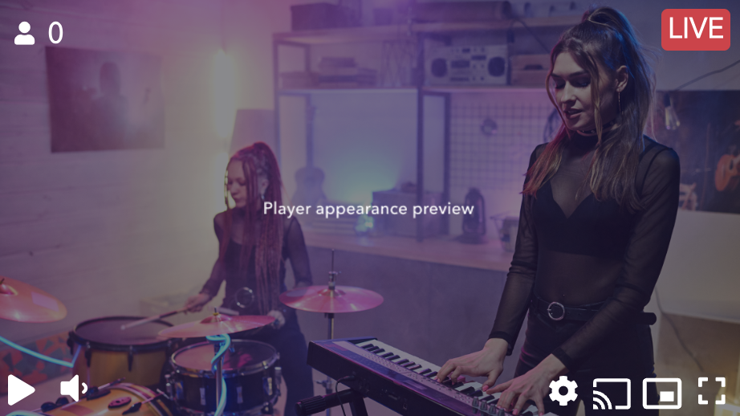

The **Hosted Player** refers to the streaming video player that can be used as a standalone web application or embedded into a website to meet the needs of many workflows without requiring extensive software development.

The player is similar to the [Live Broadcast](/millicast/streaming-dashboard/how-to-broadcast-in-dashboard.mdx) application in the dashboard but is for the audience to use to view the published stream.



> 👍 Getting Started
>
> If you haven't already, begin by following the [Getting Started](/millicast/introduction-to-streaming-apis.mdx) tutorial to create a Dolby.io application and start your first broadcast.
>
> You can follow the steps in [Part 1](/millicast/getting-started/using-the-dashboard.mdx) to learn how to use the [Live Broadcast](/millicast/streaming-dashboard/how-to-broadcast-in-dashboard.mdx) and [Hosted Player](/millicast/playback/hosted-viewer.md).

## White label playback

The standalone streaming player is a hosted web application that allows somebody to view an active stream. While it is a website itself, it does not include any account sign-up, branding, menus, or navigation elements that would make it unsuitable for use in any other product or service.

### Hosted player path

When viewed as a single-page application the URL follows this pattern:

```
https://viewer.millicast.com?streamId={Account ID}/{Stream Name}
```

### How-to embed the hosted player in a web site

You can embed the player in any website or application by using the HTML `<iframe>` element. This solution is compatible whether using a CMS like Drupal or Wordpress or more complex custom JavaScript web applications built with frameworks like React, VueJS, or Angular.

The code would be something similar to this with your own stream name and account identifiers:

```html
<iframe src="https://viewer.millicast.com?streamId={Account ID}/{Stream Name}" allowfullscreen width="640" height="480"> </iframe>
```

### How-to secure the hosted player

If your publish token is configured with the **Secure viewer** requirement than you must also include a [subscribe token](/millicast/streaming-dashboard/subscribe-tokens.mdx) for playback. The token is provided as a query string parameter such as:

```
https://viewer.millicast.com?streamId={Account ID}/{Stream Name}?token={Subscribe Token}
```

See the [Securing Stream Playback](/millicast/playback/securing-stream-playback.md) guide for more details and options.

## Hosted player components

There are a few controls and status indicators in the hosted player.

| Upper Left Corner | Upper Right Corner |
| :---------------- | :----------------- |
| Viewer count      | Stream status      |


| Lower Left Corner                     | Lower Right Corner                       |
| :------------------------------------ | :--------------------------------------- |
| Play / Pause, Audio control, Timecode | Settings, Picture-in-Picture, Fullscreen |

### Stream status

Along the top of the player are some stream status indicators such as:

- Total number of stream viewers
- **Live** / **Not Live **status badge

### Player controls

The controls along the bottom of the stream give the viewer control over a few elements of the playback experience.

#### Play / Pause

There are some [browser policies](https://github.com/orgs/dolbyio-samples/discussions/3#discussioncomment-6601624) that influence whether or not the audio and video will be available upon page load.

The end user is expected to click on the image or play button to begin viewing the stream and receiving audio.

#### Mute and volume

You can mute the stream to stop playing audio or control the volume.

#### Timecode

The timecode of the stream is displayed as an indication of the duration for the broadcast.

#### Settings

From the settings menu you can open the [Media Stats](/millicast/analytics/media-stats.mdx) and also see the **version** of the player. The details contained there can be very helpful with diagnosing any broadcast or playback issues by the support team. There is also an option to directly _Report Playback Issue_ should something happen.

In addition, if [Multi-view](/millicast/playback/multiview.md) is enabled then there will be controls to adjust the layout for multiple incoming streams.

#### Google Cast

The cast icon lets you forward the stream to a compatible device such as Google Cast compatible televisions.

#### Picture-in-picture

The Picture-in-Picture (PiP) button can be used to toggle between a mini player view.

#### Fullscreen

The full screen button will expand the player to take up the full available display.

## Customize the hosted player

There are some options available for customizing the hosted player to determine whether or not various controls will be made available to the audience. You can update these settings when clicking the **Share** button of the [Live Broadcast](/millicast/streaming-dashboard/how-to-broadcast-in-dashboard.mdx) or from the _Playback_ section of the [Streaming Dashboard](/millicast/streaming-dashboard/index.mdx).

### Playback controls

The following controls have a toggle so you can enable or disable whether or not they will appear in the player:

- Play / pause control
- Mute / volume control
- Google cast
- Picture in picture
- Fullscreen

You can also toggle whether or not to display basic stream status details:

- Live / Not live badge
- Viewer count

For convenience there is also a toggle to hide all controls.

### Playback display

#### Height and width

You can set the height and width of the iFrame window that will contain the player.

#### Autoplay

Choose whether or not to autoplay the stream.

#### Muted on start

Choose whether the stream should begin muted or with audio.

### Offline image URL

See [Stream Preview](/millicast/playback/customize-your-player.md) for more details about setting the poster image.

### Settings

You can also launch the [Media Stats](/millicast/analytics/media-stats.mdx) to get diagnostic details about the stream performance from the perspective of the end-user audience experienced during playback.
