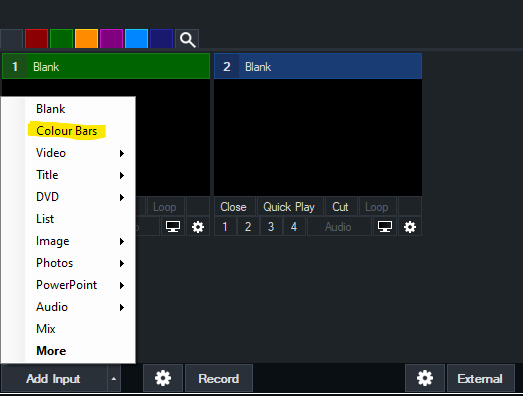
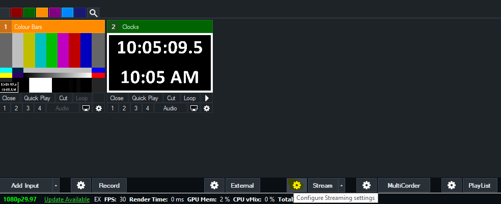
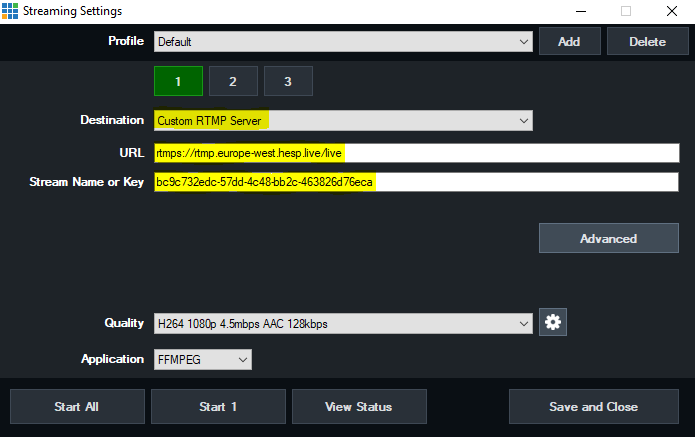
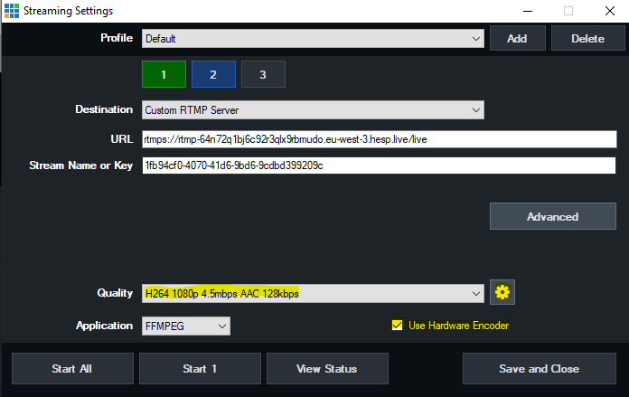
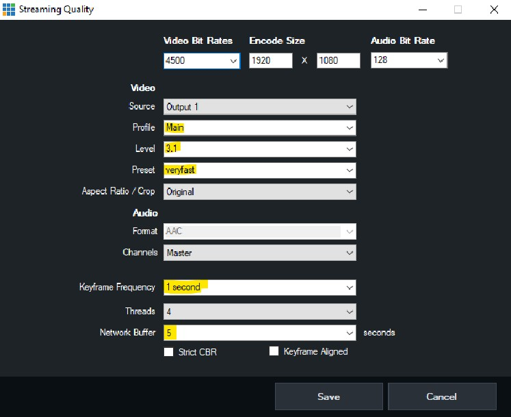

# Using vMix with THEOlive

This guide explains to you how to set up vMix correctly so it can be used to stream your content with THEOlive.

## 1. Set up sources

Make sure all your sources are set up and in order. As an example, you could add simple colour bars as a source by left-clicking the _up arrow_ next to _Add Input_, which you can find at the left bottom of the vMIX screen, and select _Colour Bars_. Similarly, you could add other input e.g. your webcam by selecting _Camera_ or a stream by selecting _Stream/SRT_. In order to see these options, you'll have to select _More_ in the _Add Input_ menu.

**Note:** The colour bars input are only an example. You can stream whatever input you like.

:::info 📘 How to burn in a clock
If you want to burn in a clock you can follow the steps documented by vMix. You can create a _Production clock_ input and burn it into the colour bars input by configuring _Multiview_  
[Production clock documentation](https://www.vmix.com/help23/index.htm?ProductionClocks.html)  
[Multiview documentation](https://www.vmix.com/help23/index.htm?InputSettingsMultiView.html)
:::

## 2. Configure stream settings

- Left-click the cogwheel next to _Stream_ at the bottom of the vMix screen.

**Note:** Make sure you set up your settings first before clicking the _Stream_ button.

- In the _Streaming Settings_ select _Custom RTMP Server_ as your destination and enter _your RTMP push URL and Streamkey_ as follows:

**Note:** You can find your RTMP push URL and streamkey in the THEOlive management console.

- Next, choose a set of stream values such as aspect ratio and bitrate from the _Quality_ list and click the cogwheel for advanced _Streaming Quality_ settings.

**Note:** If you have the hardware available: it's always a good idea to enable the _Hardware Ecoder_ setting.

- In the _Streaming Quality_ menu you can make some more advanced changes to your stream settings. Please use the settings that are highlighted in yellow in the following image to achieve optimal performance when streaming to THEOlive. You are free to change the _Video Bit Rates_ and _Encode Size_ settings depending on your use case.

**Note:\*** You are free to experiment with your encoding settings but the values shown in this image reflect the encoding setting THEOlive uses on the server side.

:::info 🚧 Frame rate and bandwidth
Remember to set the frame rate to the same value as in your THEOlive channel ingest configuration and make sure that your encoder has a stable connection and enough upload bandwidth. See [Stream configuration](../stream-configuration.mdx) for more details.
:::

## 3. Start streaming

You can now save and exit out of all the _Streaming Settings_ menus and click the _Stream_ button to start streaming.

## 4. Start your THEOlive channel

This can be done either through the [API](https://developers.theo.live/reference/start-channel) or via the [management console](https://console.theo.live/).
