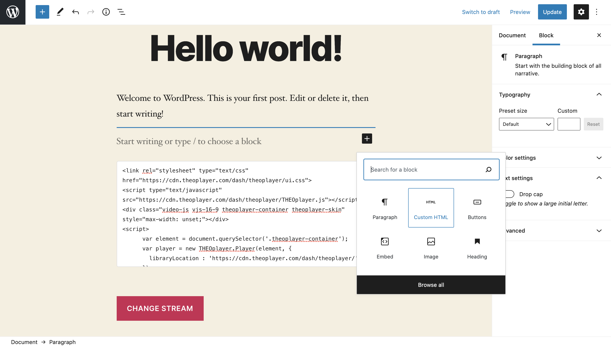
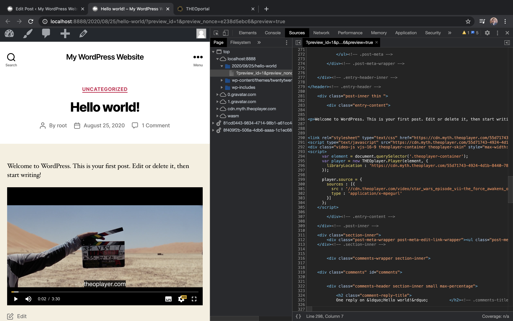

# Getting started with WordPress

[WordPress](https://wordpress.org/) is a popular CMS. [Wikipedia](https://en.wikipedia.org/wiki/WordPress) writes that it was originally aimed at blogs,
but nowadays it's leveraged for all sorts of use-cases. It's not uncommon to want to embed a video player on a WordPress website.

This guide describes one approach to integrate the THEOplayer Web SDK in an open-source WordPress.org deployment by using _Custom Code Blocks_ and the _Code Editor_.
As a developer, you can also opt for different approaches, as explained by [https://webdesign.tutsplus.com/tutorials/how-to-add-custom-javascript-to-your-wordpress-site--cms-34368](https://webdesign.tutsplus.com/tutorials/how-to-add-custom-javascript-to-your-wordpress-site--cms-34368) and [https://www.wpbeginner.com/wp-tutorials/how-to-easily-add-javascript-in-wordpress-pages-or-posts/](https://www.wpbeginner.com/wp-tutorials/how-to-easily-add-javascript-in-wordpress-pages-or-posts/).

Interested in our WordPress 5+ plugin? [Reach out to us](https://www.theoplayer.com/contact) if you want to evaluate this.

## Selected approach

We use "[Custom HTML blocks](https://wordpress.com/support/wordpress-editor/blocks/custom-html-block/)" and the "[Code Editor](https://wordpress.com/support/editors/)" as our approach. Both features are accessible by default in a fresh WordPress.org 5.5 installation.
This approach allows us to embed JavaScript and CSS libraries, as well as write unique JavaScript and HTML code for a specific page. Why is that relevant?
When using the THEOplayer Web SDK, you use JavaScript to specify which video stream you want to configure, and typically you want to configure one (or more) unique streams per page.

### Alternatives

#### Code Embed plugin

You could use the [Code Embed plugin](https://wordpress.org/plugins/simple-embed-code/#description) because it allows you to embed unique JavaScript code per page (or post).

Other popular plugins, like [Insert Headers and Footers](https://wordpress.org/plugins/insert-headers-and-footers/), allow you to insert code which
is shared across all posts and pages. This is useful for tracker scripts or pixels (like Google Analytics), but less so for video players which should
only be integrated on some pages and with a unique video stream configured per page.
You could consider using a plugin like "Insert Headers and Footers" to load the THEOplayer JavaScript and CSS files (i.e. the SDK files) on every page,
but you typically still want to embed some unique JavaScript code per page to configure the unique video stream.

_We have no affiliation with these plugins or their creators. They were just the first applicable plugins which popped up when looking._

#### \<iframe\>

You can embed THEOplayer through an `<iframe>` instead of through JavaScript.
Please refer to "[How to embed an iframe](https://docs.theoplayer.com/getting-started/01-sdks/01-web/03-how-can-we-embed-iframe.md)" for more information on setting up an iframe.

## Step-by-step guide

### 1. WordPress.org deployment

You must have a valid WordPress.org deployment. We used WordPress version 5.5 in a [local MAMP set-up](https://skillcrush.com/blog/install-wordpress-mac/) when writing this article.

### 2. THEOplayer SDK

You must have the THEOplayer Web SDK library files (`THEOplayer.js`, `ui.css`, ...),
or you must know how to refer to them and the `libraryLocation`. You've read through our [Web SDK Getting Started Guide](<(../../../getting-started/01-sdks/01-web/00-getting-started.md)>),
and you understand all of its content.

### 3. Locate post or page

Navigate to the page where you want to integrate the THEOplayer Web SDK.

### 4. Include THEOplayer SDK

First off, you want to include the THEOplayer CSS file and THEOplayer JavaScript file by adding the code below through a Custom HTML block.

```html
<link rel="stylesheet" type="text/css" href="/path/to/libraryLocation/ui.css" />
<script
  type="text/javascript"
  src="/path/to/libraryLocation/THEOplayer.js"
></script>
```

The screenshot below shows you how to access such a "Custom HTML block".


### 5. Create container

Create the HTML `<div>` container which should load your video player instance.

Your Custom HTML block should now be similar to the code below.

```html
<link rel="stylesheet" type="text/css" href="/path/to/libraryLocation/ui.css" />
<script
  type="text/javascript"
  src="/path/to/libraryLocation/THEOplayer.js"
></script>
<div class="video-js vjs-16-9 theoplayer-container theoplayer-skin"></div>
```

You can set the CSS of this container directly in the `<div>` tags by using `<div style="height: ...">`, or you could
add additional CSS to your page.

We added `vjs-16-9` to the `<div class="...` because we want THEOplayer to render in a 16:9 aspect ratio.
Sometimes, the CSS and styles of your WordPress theme might clash with THEOplayer's styling. It is your responsibility to
identify styling issues caused by your theme. For example, the CSS of our WordPress skin tried to meddle with the width
of our container, so we manually unset it as demonstrated below.

```html
<div
  class="video-js vjs-16-9 theoplayer-container theoplayer-skin"
  style="max-width: unset;"
></div>
```

### 6. Configure video

Finally, you want to create your video player instance and configure a video stream for this player instance.

You can achieve this by expanding your Custom HTML block to resemble the snippet below:

```html
<link rel="stylesheet" type="text/css" href="/path/to/libraryLocation/ui.css" />
<script
  type="text/javascript"
  src="/path/to/libraryLocation/THEOplayer.js"
></script>
<div
  class="video-js vjs-16-9 theoplayer-container theoplayer-skin"
  style="max-width: unset;"
></div>
<script>
  var element = document.querySelector(".theoplayer-container");
  var player = new THEOplayer.Player(element, {
    libraryLocation: "/path/to/libraryLocation/",
    license: "your-license-here"
  });

  player.source = {
    sources: [
      {
        src: "//cdn.theoplayer.com/video/star_wars_episode_vii-the_force_awakens_official_comic-con_2015_reel_(2015)/index.m3u8",
        type: "application/x-mpegurl"
      }
    ]
  };
</script>
```

All of this should result in a demo similar to the screenshot below.


## Note

<!--
* A 4' video walk-through is available at [https://demo.theoplayer.com/test-your-stream-with-statistics?url=https://content.uplynk.com/98550a2350ee4bfa8eeea6d54e40e096.m3u8](https://demo.theoplayer.com/test-your-stream-with-statistics?url=https://content.uplynk.com/98550a2350ee4bfa8eeea6d54e40e096.m3u8).
-->

- Steps 4-6 are similar to our [Getting Started guide for Web SDK](../../../getting-started/01-sdks/01-web/00-getting-started.md) so you might want to consider checking out that article as well.
