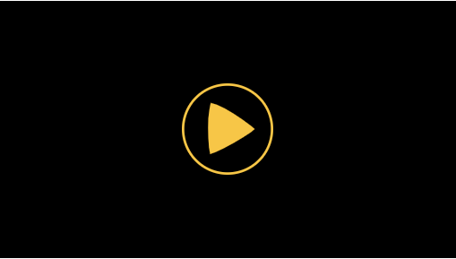

# How to make an audio-only player

This article will tell you how to manipulate THEOplayer (Web) to make an audio-only interface, using only CSS and JavaScript. This applies also to mobile SDKs, where CSS and javascript can be injected (see _Resources_).

Going from this


to this


## SDKs

| Web SDK |                    Android SDK                    |                      iOS SDK                      | tvOS SDK |                  Android TV SDK                   | Chromecast SDK |
| :-----: | :-----------------------------------------------: | :-----------------------------------------------: | :------: | :-----------------------------------------------: | :------------: |
|   Yes   | Unverified / Through CSS and JavaScript injection | Unverified / Through CSS and JavaScript injection |    No    | Unverified / Through CSS and JavaScript injection |      N/A       |

## Making the audio player from the video player

This section explains how to alter the default video player UI into the UI shown in the picture below, thus transforming a default THEOplayer instance in an audio player. This can, of course, be further customised to your liking to adapt to the rest of your implementation.


The alteration involves 8 steps:

1. Add a new class to 2 HTML elements in the player (JavaScript)
2. Hide unnecessary buttons from the control bar (CSS)
3. Hide content that might appear above the control bar (CSS)
4. Decrease the player's height (CSS)
5. Ensure the control bar is always visible (CSS)
6. Rescale the loading spinner (CSS)
7. Change appearance for when the stream is not yet loaded (CSS)
8. (Optional) Add the audioOnly flag (JavaScript)

In the following, you can find a description and a code example for each step.

## Code examples

##### Web SDK

### 1 - Add a new class to 2 HTML elements in the player

To comfortably provide the required CSS during the next steps, we add CSS classes to two HTML elements, respectively:

1. 'audioplayer' to the player element (select it using the 'vjs-fluid' class)
2. 'audiocontrol' to the controls element (select it using the 'vjs-control-bar' class)

```js
function transformPlayer(forAudio) {
  var player = document.querySelector(".vjs-fluid");
  var controlbar = document.querySelector(".vjs-control-bar");
  if (forAudio) {
    player.classList.add("audioplayer");
    controlbar.classList.add("audiocontrol");
  } else {
    player.classList.remove("audioplayer");
    controlbar.classList.remove("audiocontrol");
  }
}
```

### 2 - Hide unnecessary buttons from the control bar

There are a bunch of buttons in the control bar that might not be relevant for an audio-only stream. Hence, we hide the following buttons using CSS:

- Subtitles button
- Quality label
- Audio menu
- Settings menu
- Fullscreen control
- Cast button

```css
.audiocontrol .vjs-icon-subtitles,
.audiocontrol .theo-quality-label,
.audiocontrol .vjs-icon-audio,
.audiocontrol .vjs-icon-cog,
.audiocontrol .vjs-fullscreen-control,
.audiocontrol .theo-cast-button,
.audioplayer video {
  display: none !important;
}
```

### 3 - Hide content that might appear above the control bar

Now we need to make sure no content appears above our controls. Again, we use CSS to hide elements:

- Poster image
- Video
- Metadata (like song info)

```css
.audiocontrol .theoplayer-poster,
.audiocontrol .song-info,
.audioplayer video {
  display: none !important;
}
```

### 4- Decrease the player's height

Next up, decreasing the player height to 50px.

```css
.audioplayer {
  padding: 0 !important;
  height: 50px !important;
}
```

### 5 Ensure the control bar is always visible

By default, the control bar fades away to ensure better user experience for the video viewer. The following snippet ensures that the controls stay always visible.

```css
.audiocontrol.vjs-control-bar {
  visibility: visible !important;
  opacity: 1 !important;
  display: flex !important;
}
```

### 6 - Rescale the loading spinner

An optional step is to scale the loading icon that spins when the player stalls.

```css
.audioplayer .vjs-loading-spinner {
  transform: scale(0.3) !important;
}
```

### 7 - Change appearance for when the stream is not yet loaded

We're almost there. We just need to remove the giant play-button that shows when the video hasn't started yet.

```css
:not(.vjs-has-started).audioplayer .vjs-big-play-button {
  display: none !important;
}
```

Should we stop here, the audio player would show 0:00 / 0:00 as time information, since the stream is not yet loaded. This looks a bit clumsy, so we can hide it until the stream has started.

```css
:not(.vjs-has-started).audioplayer .vjs-current-time,
:not(.vjs-has-started).audioplayer .vjs-time-divider,
:not(.vjs-has-started).audioplayer .vjs-duration {
  display: none !important;
}

.vjs-has-started .vjs-current-time,
.vjs-has-started .vjs-time-divider,
.vjs-has-started .vjs-duration {
  display: flex !important;
}
```

Note: if you preload the source (see _Resources_), hiding the time information before the player starts playing may not be needed, as the duration will be already available.

### 8 - (Optional) Add the audioOnly flag

Finally, we recommend you to set the audioOnly flag to true in the player configuration. In that case, the player will use an audio element instead of a video element for media playback.
This is only supported for HLS streams for now. Otherwise, the player uses a video element instead.
This plays without any issue on most platforms, however we have noticed that Firefox doesn’t handle video elements with height and width 0 well.

```js
const player = new THEOplayer.Player(element, {
  audioOnly: true
});
```

### Result

You should end up with a player that looks like this:


You can further modify the audio player that you have at this point to better fit in your implementation.

##### Legacy Android SDK (4.12.x)

The Web SDK code should be included in your Android (TV) project. The article at [How to add CSS or JavaScript files to an Android/iOS project](../../../version-v4/faq/01-how-to-add-css-or-javascript-files-to-android-ios.md)explains how you can add CSS and JavaScript files to your project.

##### Legacy iOS/tvOS SDK (4.12.x)

The Web SDK code should be included in your iOS project. The article at [How to add CSS or JavaScript files to an Android/iOS project](../../../version-v4/faq/01-how-to-add-css-or-javascript-files-to-android-ios.md) explains how you can add CSS and JavaScript files to your project.

## Sample application

The demo below illustrates the transformation from video player to audio player.

- Demo: [http://cdn.theoplayer.com/demos/nus/audio-only.html](http://cdn.theoplayer.com/demos/nus/audio-only.html)

## Resources

- [How to add CSS or JavaScript files to an Android/iOS project](../../../version-v4/faq/01-how-to-add-css-or-javascript-files-to-android-ios.md): How-to guide
