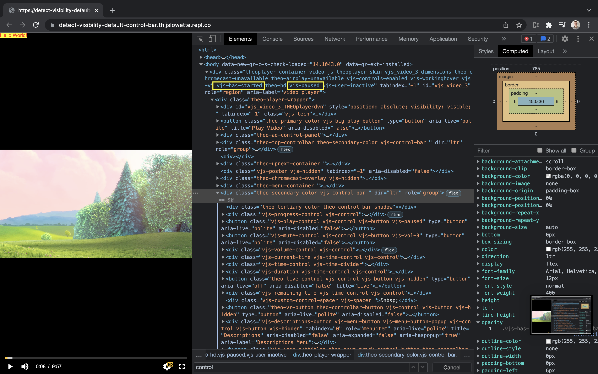

# How to detect the visibility of the default control bar

This question is typically asked by developers that want to insert a custom element that should

1. disappear when the default control bar disappears,
2. appear when the default control bar appears.

This article discusses three approaches that allow you to detect whether the control bar is visible.

1. [Using a Chromeless UI](#using-a-chromeless-ui)
2. [Using a MutationObserver](#using-a-mutationobserver)
3. [Using CSS](#using-css)

## Using a Chromeless UI

Instead of making the default THEOplayer UI fit your use cases,
it might make sense to opt for a [Chromeless UI](06-how-to-build-chromeless-ui.mdx).
When you use a Chromeless UI, you have full control over the UI and UX,
and you are not restricted to the complexities of our default UI.

## Using a MutationObserver

You can use a [`MutationObserver`](https://developer.mozilla.org/en-US/docs/Web/API/MutationObserver) to detect the visibility of the control bar.

Generally speaking, the default control bar is visible when the following scenario is true for your THEOplayer container's [`classList`](https://developer.mozilla.org/en-US/docs/Web/API/Element/classList):

1. The `vjs-user-active` class is listed in the `classList`;
2. Or if the `vjs-paused` class is listed in the `classList`;
3. And the `vjs-has-started` class is listed in the `classList`.

The control bar is visible in the screenshot below because `vjs-paused` and `vjs-has-started` are classes of the THEOplayer container,
as highlighted with the yellow rectangles.



If we map that to JavaScript code:

```javascript
const theoplayerContainer = document.querySelector(".video-js");
const controlBarVisible =
  (theoplayerContainer.classList.contains("vjs-user-active") ||
    theoplayerContainer.classList.contains("vjs-paused")) &&
  theoplayerContainer.classList.contains("vjs-has-started");
```

This approach is also valid for our default UI on the iOS and Android SDK,
because their default UI can be customized through the same JavaScript (and CSS) as explained at

1. [iOS SDK Customization](../../../theoplayer_versioned_docs/version-v4/getting-started/01-sdks/03-ios/01-ios-sdk-customization.md) for the iOS SDK
2. [Android Legacy (4.12.x) SDK Customization](../../../theoplayer_versioned_docs/version-v4/getting-started/01-sdks/02-android/01-android-sdk-customization.md) for the Android SDK

It should be noted that this approach does not take the opacity of the control bar into account.
The default control bar UI has a "fade in" and "fade out" effect.
If you want to take this into account, you can capture its opacity through JavaScript when you have a reference to your control bar DOM element.
The snippet below illustrates how you could poll the opacity every 100ms.

```javascript
setInterval(function () {
  const controlBar = document.querySelectorAll(".vjs-control-bar")[1];
  const controlBarOpacity = getComputedStyle(controlBar).opacity;
  console.log("control bar opacity", controlBarOpacity);
}, 100);
```

The next sub-sections discusses this approach in more detail per SDK.

### SDKs

| Web SDK |                  iOS SDK                  |                 Android SDK                 | tvOS SDK |               Android TV SDK                | Roku SDK | Chromecast SDK |
| :-----: | :---------------------------------------: | :-----------------------------------------: | :------: | :-----------------------------------------: | :------: | :------------: |
|   Yes   | Verified through CSS/JavaScript injection | Unverified through CSS/JavaScript injection |    No    | Unverified through CSS/JavaScript injection |   N/A    |      N/A       |

#### Web SDK

The snippet below demonstrates how use the previously specified `controlBarVisible` variable in combination with a `MutationObserver`.

```javascript
const theoplayerContainer = document.querySelector(".video-js");
var controlBarObserver = new MutationObserver(function (event) {
  for (let i = 0; i < event.length; i++) {
    const el = event[i].target;
    const controlBarVisible =
      (el.classList.contains("vjs-user-active") ||
        el.classList.contains("vjs-paused")) &&
      el.classList.contains("vjs-has-started");
    const message = {
      controlBarVisible: controlBarVisible
    };
    console.log(message);
  }
});
controlBarObserver.observe(theoplayerContainer, {
  attributes: true,
  attributeFilter: ["class"],
  childList: false,
  characterData: false
});
```

You can try out this snippet at [https://detect-visibility-default-control-bar--thijslowette.repl.co/](https://detect-visibility-default-control-bar--thijslowette.repl.co/),
and verify the `{"controlBarVisible": true}` (or `{"controlBarVisible": false}`) logs in the developer console.

#### Legacy iOS/tvOS SDK (4.12.x)

You can leverage the approach of the Web SDK in your iOS project.

Firstly, you'll need to set up your project to support communication between your native code and JavaScript.
This flow is described at [iOS SDK Customization](../../../theoplayer_versioned_docs/version-v4/getting-started/01-sdks/03-ios/01-ios-sdk-customization.md).

This means that your JavaScript code could resemble the snippet below:

```javascript
const theoplayerContainer = document.querySelector(".video-js");
var controlBarObserver = new MutationObserver(function (event) {
  for (let i = 0; i < event.length; i++) {
    const el = event[i].target;
    const controlBarVisible =
      (el.classList.contains("vjs-user-active") ||
        el.classList.contains("vjs-paused")) &&
      el.classList.contains("vjs-has-started");
    const message = {
      controlBarVisible: controlBarVisible
    };
    console.log(message);
    window.webkit.messageHandlers.myMessageName.postMessage(message);
  }
});
controlBarObserver.observe(theoplayerContainer, {
  attributes: true,
  attributeFilter: ["class"],
  childList: false,
  characterData: false
});
```

Notice that we've only added the line below which posts message to your native code:

```javascript
window.webkit.messageHandlers.myMessageName.postMessage(message);
```

Next, you need to be able to intercept this message in your native code,
as demonstrated by the snippet below.

```swift
func onMessageReceived(message : [String:Any]) {
    print(message)
    let isControlsVisible : Int = message["isControlsVisible"] as! Int
    if (isControlsVisible == 1) {
        print("controls are visible")
    } else {
        print("controls are not visible")
    }
}
theoplayer.addJavascriptMessageListener(name: "myMessageName", listener: onMessageReceived)
```

You can now use this `onMessageReceived` callback to detect the visibility in your iOS project through native code.

##### Legacy Android SDK (4.12.x)

Adopt the above iOS approach to Android.
The communication between native Android and JavaScript is documented at [Android Legacy (4.12.x) SDK Customization](../../../theoplayer_versioned_docs/version-v4/getting-started/01-sdks/02-android/01-android-sdk-customization.md).

## Using CSS

If you insert your custom elements through JavaScript,
you can use CSS queries to align the visibility of your custom controls with the default control bar.

The snippet at [https://detect-visibility-default-control-bar--thijslowette.repl.co/](https://detect-visibility-default-control-bar--thijslowette.repl.co/)
has a text ("Hello World!") that's only visible when the control bar is visible.
We also leverage the `vjs-has-started`, `vjs-paused` and `vjs-user-active` classes mentioned in the previous approach.
